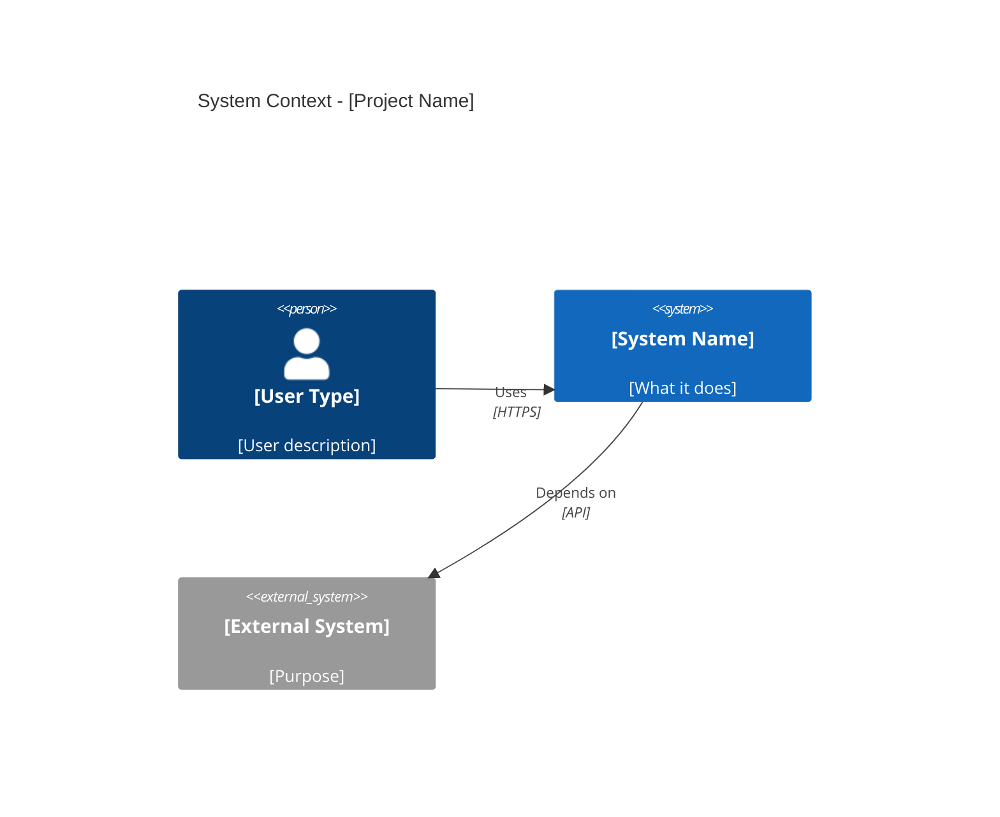
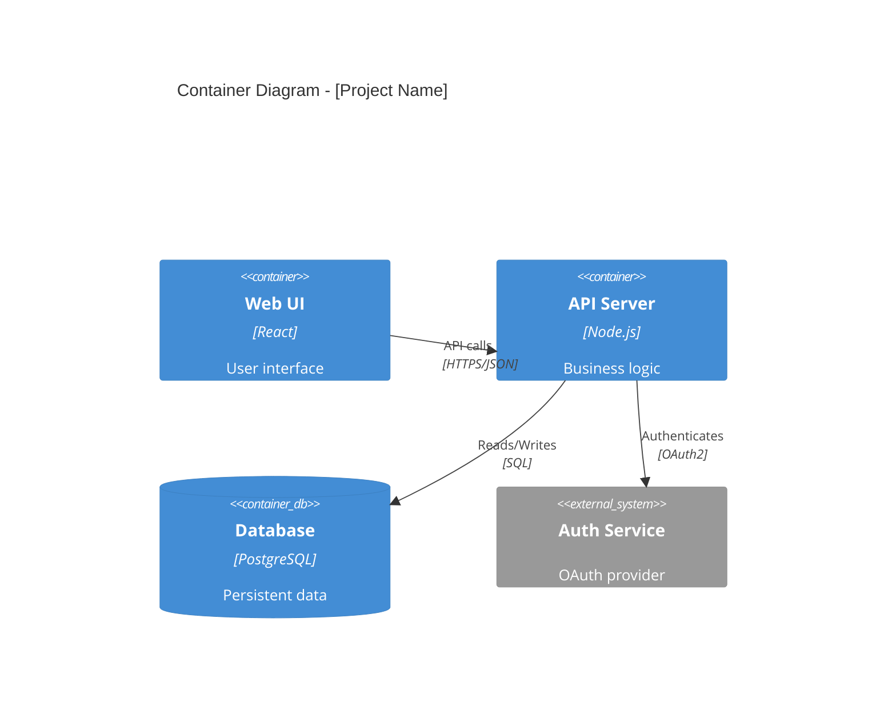
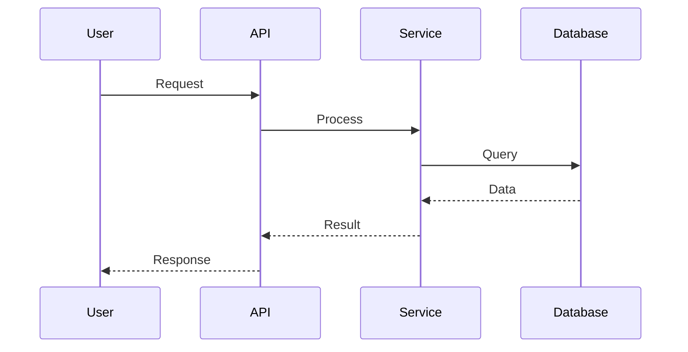
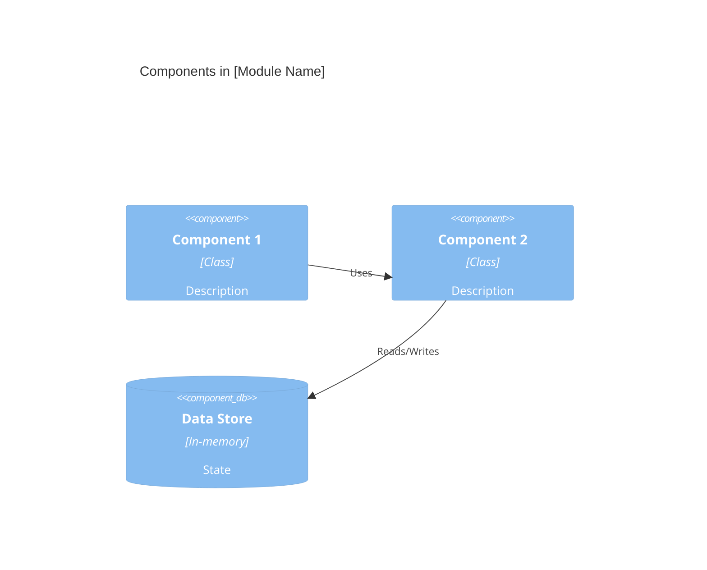

# Architecture Documenter Skill

## Purpose
Transform codebase understanding into professional C4 architecture documentation with diagrams and clear explanations.

## When to Use

Activate when user requests:
- "Generate architecture documentation"
- "Create C4 diagrams for this project"
- "Document the system architecture"
- "Explain the architecture"
- "Write technical documentation"

## What is C4 Architecture?

The **C4 model** provides a hierarchical way to document software architecture:

- **C1 - System Context**: Big picture - system, users, external systems
- **C2 - Container**: High-level technology choices - web apps, databases, services
- **C3 - Component**: Detailed view - modules, classes, workflows
- **C4 - Code**: Implementation details - class diagrams, code structure

## Workflow

### Phase 1: Gather Context (Quick Analysis)

If codebase has already been analyzed by `codebase-analyzer` skill:
- Reuse that analysis from conversation context
- Skip redundant scanning

If not analyzed yet:
1. **Quick Project Scan**
   - Detect language and framework
   - Read README and main config file
   - Identify entry points

2. **Structure Overview**
   - Use Glob to find key directories
   - Identify main modules
   - Map high-level organization

### Phase 2: Generate C1 - System Context

Create `docs/01-system-context.md`:

**Content Template** (see `templates/c4-context.md`):
```markdown
# System Context

## System Purpose
[What problem does this system solve? Who benefits?]

## System Context Diagram



## Users and Stakeholders
- **[User Type 1]**: [Needs and goals]
- **[User Type 2]**: [Needs and goals]

## System Boundaries
**In Scope**: [What the system handles]
**Out of Scope**: [What it doesn't handle]
```

**How to Create**:
1. Read README to understand purpose
2. Identify user personas from documentation
3. Extract external dependencies from config files
4. Generate Mermaid C4Context diagram
5. Write clear, concise descriptions

### Phase 3: Generate C2 - Container View

Create `docs/02-architecture.md`:

**Content Template** (see `templates/c4-container.md`):
```markdown
# Architecture

## Technology Stack
- **Language**: [Primary language + version]
- **Framework**: [Main framework]
- **Database**: [If applicable]
- **Deployment**: [Target platform]

## Container Diagram



## Architecture Patterns
- **Pattern**: [e.g., Layered, Microservices, Event-driven]
- **Rationale**: [Why this pattern was chosen]

## Design Decisions
1. **[Decision]**: [Rationale and trade-offs]
2. **[Decision]**: [Rationale and trade-offs]
```

**How to Create**:
1. Analyze main config file for dependencies
2. Identify architectural layers from directory structure
3. Recognize patterns (layered, microservices, etc.)
4. Create C4Container diagram showing major components
5. Document key design decisions

### Phase 4: Generate C3 - Component View

Create two documents:

#### 4a. `docs/03-workflows.md` - Key Workflows

```markdown
# Key Workflows

## Workflow 1: [Primary User Flow]

### Process Diagram


### Steps
1. [Step description]
2. [Step description]

## Workflow 2: [Secondary Flow]
[...]
```

**How to Create**:
1. Identify main user journeys from code
2. Trace execution flow through modules
3. Create sequence diagrams
4. Document each step clearly

#### 4b. `docs/04-key-modules.md` - Module Deep Dive

```markdown
# Key Modules

## Module: [Module Name]

**Location**: `src/module/`
**Purpose**: [What this module does]

### Responsibilities
- [Responsibility 1]
- [Responsibility 2]

### Key Components
1. **[Component]** (`file.ext`)
   - Purpose: [...]
   - Exports: [...]
   - Dependencies: [...]

### Component Diagram

```

**How to Create**:
1. Identify 3-5 most important modules
2. Read source files to understand responsibilities
3. Extract exports and interfaces
4. Create component diagrams showing internals
5. Document interactions

### Phase 5: Generate C3 - Boundary Documentation

Create `docs/05-api-boundaries.md`:

```markdown
# API Boundaries

## Public Interfaces

### REST API Endpoints

**Base URL**: `/api/v1`

| Method | Endpoint | Description | Auth |
|--------|----------|-------------|------|
| GET | `/users` | List users | Required |
| POST | `/users` | Create user | Required |

### Library Exports (if library)

```typescript
export interface Config { ... }
export function initialize(): void;
export class Manager { ... }
```

### Configuration Interface

**Environment Variables**:
- `API_KEY`: Authentication key (required)
- `DATABASE_URL`: Database connection (optional)

**Config File** (`config.toml`):
```toml
[server]
port = 8080
host = "0.0.0.0"
```
```

**How to Create**:
1. Identify public API endpoints from code
2. Extract exported functions/classes
3. Document configuration options
4. Create interface specifications

### Phase 6: Validation & Enhancement

1. **Validate Mermaid Syntax**
   - Check all diagrams render correctly
   - Fix common syntax errors
   - Ensure proper node references

2. **Cross-Reference Check**
   - Verify all internal links work
   - Ensure terminology consistency
   - Validate technical accuracy

3. **Quality Review**
   - Clear, concise language
   - Proper grammar and formatting
   - Diagrams add value (not just decoration)

## Output Structure

```
docs/
├── 01-system-context.md      # C1: Big picture
├── 02-architecture.md         # C2: Containers
├── 03-workflows.md            # C3: Process flows
├── 04-key-modules.md          # C3: Component details
├── 05-api-boundaries.md       # C3: Interfaces
└── README.md                  # Documentation index
```

## Customization Options

### Language Selection

Ask user: **"Which language should I use for documentation?"**

Supported languages:
- English (default)
- 简体中文 (Chinese Simplified)
- 日本語 (Japanese)
- 한국어 (Korean)
- Deutsch (German)
- Français (French)
- Русский (Russian)
- Tiếng Việt (Vietnamese)

See `multi-language-doc-generator` skill for localization.

### Detail Level

Ask user: **"How detailed should the documentation be?"**

- **Executive** (C1 only): High-level overview for stakeholders
- **Standard** (C1-C2): Overview + architecture for developers
- **Comprehensive** (C1-C3): Full documentation including workflows
- **Complete** (C1-C4): Everything including code-level details

### Output Format

- **Markdown** (default): For Git repos, static site generators
- **Confluence**: For team wikis
- **HTML**: For standalone documentation sites

## Mermaid Diagram Best Practices

### Diagram Types by C4 Level

| Level | Diagram Type | Mermaid Syntax |
|-------|-------------|----------------|
| C1 | System Context | `C4Context` |
| C2 | Container | `C4Container` |
| C3 | Component | `C4Component`, `sequenceDiagram`, `flowchart` |
| C4 | Code | `classDiagram`, `erDiagram` |

### Auto-Fix Common Issues

The skill automatically fixes:
- Missing closing braces
- Invalid character escaping
- Malformed relationship syntax
- Incorrect indentation

Reference: `templates/mermaid-patterns.md`

## Integration Points

### Input Sources

Can consume data from:
- **codebase-analyzer** skill output (preferred)
- User-provided architecture notes
- Existing README files
- Code comments and documentation

### Output Consumers

Generated docs can feed into:
- Static site generators (Docusaurus, VitePress, MkDocs)
- Wiki systems (Confluence, Notion, GitHub Wiki)
- PDF generators
- Presentation tools

## Examples

### Example 1: Rust Web API

**Input**: Rust project with Actix-web
**Output**:
- System context showing API, clients, database
- Container diagram with web server, workers, cache
- Workflow diagrams for request handling
- Module documentation for handlers, services, models

See `reference/rust-web-api-example.md` for full output.

### Example 2: React Frontend

**Input**: TypeScript React application
**Output**:
- System context showing SPA, backend API, CDN
- Container diagram with React app, state management, routing
- Component diagram showing React component hierarchy
- API boundary documentation for backend integration

See `reference/react-app-example.md` for full output.

## Quality Checklist

Before finalizing documentation:

- [ ] All Mermaid diagrams render correctly
- [ ] Terminology is consistent throughout
- [ ] Technical details are accurate
- [ ] Descriptions are clear and concise
- [ ] Diagrams have titles and legends
- [ ] Internal links work correctly
- [ ] Code examples are syntax-highlighted
- [ ] User personas are realistic
- [ ] External dependencies are identified
- [ ] Design decisions are justified

## Tips for Best Results

1. **Start with existing docs**: Read README first to understand intent
2. **Follow the code**: Let implementation guide documentation, not assumptions
3. **Be specific**: Use actual technology names (React, PostgreSQL) not generic terms
4. **Show relationships**: Diagrams should illustrate connections, not just list boxes
5. **Explain why**: Document design decisions and trade-offs, not just what exists

## Troubleshooting

### Issue: Can't understand project purpose
**Solution**:
- Read README.md and package description
- Look for main() function to understand entry point
- Check test files for usage examples

### Issue: Too many components to document
**Solution**:
- Focus on top 3-5 most important modules
- Group related components together
- Use "and more" to indicate additional items

### Issue: Mermaid diagram too complex
**Solution**:
- Split into multiple diagrams by concern
- Use abstraction layers (don't show every detail)
- Create separate diagram for each workflow

## References

For detailed guidance:
- `templates/c4-context.md` - System context template
- `templates/c4-container.md` - Architecture template
- `templates/c4-component.md` - Component template
- `templates/mermaid-patterns.md` - Diagram patterns and examples
- `reference/best-practices.md` - Documentation writing guide
