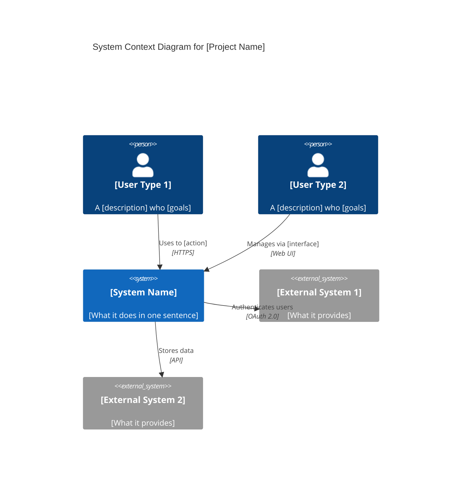
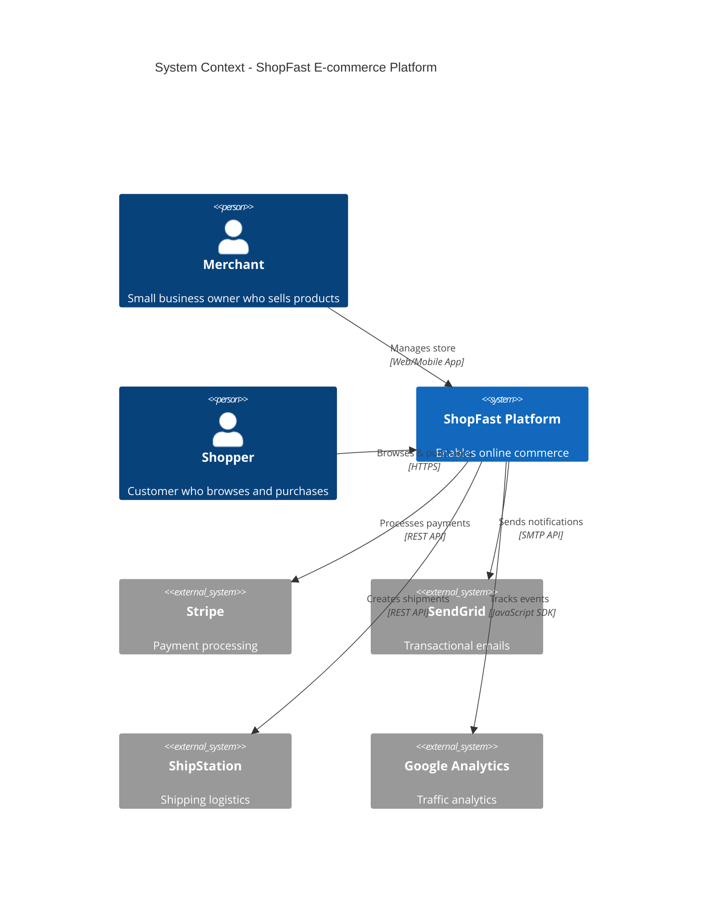
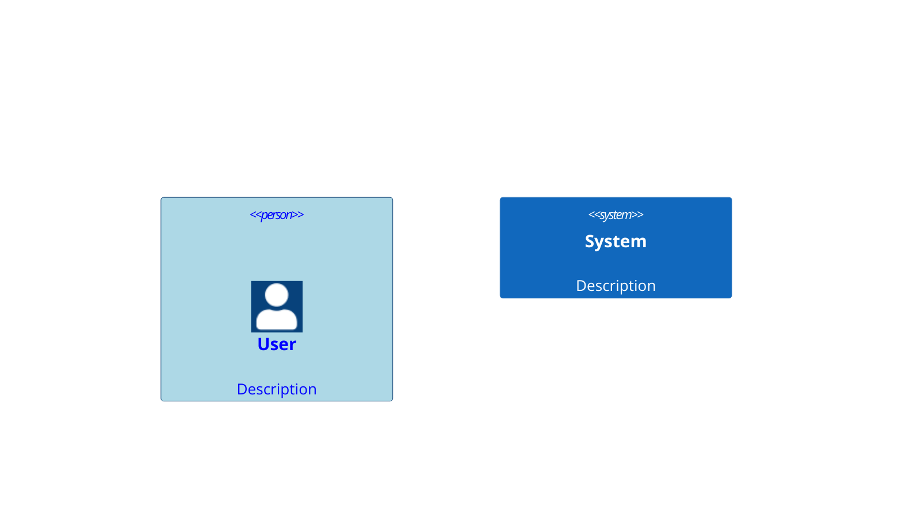
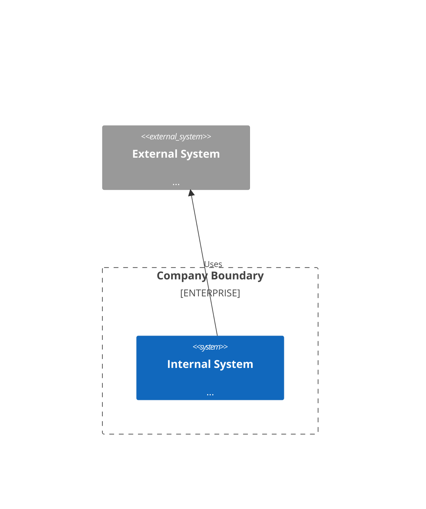

# System Context Template (C4 Level 1)

Use this template to create high-level system context documentation.

---

## Basic Template

```markdown
# System Context: [Project Name]

## Executive Summary

**[Project Name]** is a [type of system] that [core purpose/value proposition].

**Target Users**: [Primary user types]
**Key Benefit**: [Main problem solved]

## System Purpose

### Problem Statement
[What problem does this system solve? What pain points does it address?]

### Solution Approach
[How does the system solve the problem? What's unique about the approach?]

### Success Criteria
- [Measurable outcome 1]
- [Measurable outcome 2]
- [Measurable outcome 3]

## System Context Diagram



## Users and Stakeholders

### Primary Users

**[User Type 1]**: [User Persona Name]
- **Role**: [Job title or role]
- **Goals**: [What they want to achieve]
- **Needs**: [What they need from the system]
- **Pain Points**: [Current problems this solves for them]

**[User Type 2]**: [User Persona Name]
- **Role**: [Job title or role]
- **Goals**: [What they want to achieve]
- **Needs**: [What they need from the system]
- **Pain Points**: [Current problems this solves for them]

### Secondary Stakeholders

- **[Stakeholder Type]**: [Their interest/concern]

## External Systems and Dependencies

### [External System 1]
- **Type**: [SaaS service / Internal system / Third-party API]
- **Purpose**: [What it provides to our system]
- **Integration**: [How we connect: REST API, SDK, etc.]
- **Critical?**: [Yes/No - impact if unavailable]

### [External System 2]
- **Type**: [Database / Cloud service / etc.]
- **Purpose**: [What it provides]
- **Integration**: [Connection method]
- **Critical?**: [Yes/No]

## System Boundaries

### In Scope

**The system handles**:
- [Capability 1]
- [Capability 2]
- [Capability 3]

**Key Features**:
- [Feature 1]: [Description]
- [Feature 2]: [Description]
- [Feature 3]: [Description]

### Out of Scope

**The system does NOT**:
- [What it doesn't do]
- [What users should use other tools for]
- [Future possibilities not yet implemented]

### Integration Points

**Inbound**: [What sends data/requests to this system]
- [System/User] via [protocol/method]

**Outbound**: [What this system sends to]
- [External system] via [protocol/method]

## Business Context

### Business Goals
- [Business objective 1]
- [Business objective 2]

### Success Metrics
- [Metric]: [Target value]
- [Metric]: [Target value]

### Constraints
- **Technical**: [Limitations or requirements]
- **Regulatory**: [Compliance requirements]
- **Business**: [Budget, timeline, etc.]

## Quality Attributes

### Performance
- **Response Time**: [Target, e.g., < 200ms]
- **Throughput**: [Target, e.g., 1000 req/sec]

### Security
- **Authentication**: [Method, e.g., OAuth 2.0, JWT]
- **Authorization**: [RBAC, ABAC, etc.]
- **Data Protection**: [Encryption in transit/at rest]

### Availability
- **Target Uptime**: [e.g., 99.9%]
- **Disaster Recovery**: [RTO/RPO targets]

### Scalability
- **User Scale**: [Expected number of concurrent users]
- **Data Scale**: [Expected data volume]
```

---

## Example: E-commerce Platform

```markdown
# System Context: ShopFast E-commerce Platform

## Executive Summary

**ShopFast** is an online e-commerce platform that enables small businesses to sell products online without technical expertise.

**Target Users**: Small business owners, shoppers
**Key Benefit**: Launch an online store in minutes, not weeks

## System Purpose

### Problem Statement
Small businesses struggle to establish online presence due to:
- High costs of custom development
- Technical complexity of existing platforms
- Limited integration options

### Solution Approach
ShopFast provides a no-code platform with:
- Pre-built templates for instant setup
- Integrated payment processing
- Built-in marketing tools
- Mobile-first design

### Success Criteria
- Merchants can launch store in < 30 minutes
- 99.9% uptime for payment processing
- Support 10,000+ concurrent shoppers

## System Context Diagram



## Users and Stakeholders

### Primary Users

**Merchant**: Sarah's Handmade Crafts
- **Role**: Small business owner
- **Goals**: Sell handmade products online, manage inventory
- **Needs**: Easy-to-use interface, payment processing, order management
- **Pain Points**: Limited tech skills, tight budget, needs to focus on product creation

**Shopper**: Tech-savvy millennial buyer
- **Role**: Online consumer
- **Goals**: Find unique products, secure checkout, track orders
- **Needs**: Fast page loads, mobile experience, easy returns
- **Pain Points**: Slow checkout flows, hidden fees

### Secondary Stakeholders

- **ShopFast Support Team**: Customer success, handle merchant issues
- **Payment Partners**: Ensure PCI compliance, fraud prevention

## External Systems and Dependencies

### Stripe (Payment Processing)
- **Type**: SaaS payment gateway
- **Purpose**: Credit card processing, subscriptions, payouts
- **Integration**: Stripe SDK + REST API
- **Critical?**: YES - cannot process orders without it

### SendGrid (Email Service)
- **Type**: Email delivery SaaS
- **Purpose**: Order confirmations, shipping updates, marketing
- **Integration**: SMTP API + Web API
- **Critical?**: MEDIUM - orders can complete, but customer experience degrades

### ShipStation (Logistics)
- **Type**: Third-party shipping platform
- **Purpose**: Generate labels, track shipments, manage carriers
- **Integration**: REST API webhooks
- **Critical?**: NO - merchants can ship manually

## System Boundaries

### In Scope

**The system handles**:
- Storefront creation and customization
- Product catalog management
- Shopping cart and checkout
- Order processing and fulfillment
- Merchant dashboard and analytics
- Customer accounts

**Key Features**:
- **Store Builder**: Drag-and-drop template customization
- **Inventory Management**: Stock tracking, variants, SKUs
- **Multi-channel Selling**: Sync with social media marketplaces
- **Built-in SEO**: Meta tags, sitemaps, performance optimization

### Out of Scope

**The system does NOT**:
- Manufacture or warehouse products (that's the merchant's job)
- Provide customer service to shoppers (merchant handles that)
- Handle tax filing (provides data, merchant files taxes)
- Design custom graphics (merchants use templates or upload own)

### Integration Points

**Inbound**:
- Merchants via Web Dashboard and Mobile App
- Shoppers via Storefront (web)
- Webhooks from Stripe (payment events)
- Webhooks from ShipStation (tracking updates)

**Outbound**:
- Stripe for payment processing
- SendGrid for emails
- ShipStation for shipping
- Google Analytics for tracking

## Business Context

### Business Goals
- Onboard 10,000 merchants in Year 1
- Process $50M in GMV (Gross Merchandise Value)
- Achieve 99.9% platform uptime

### Success Metrics
- **Merchant Retention**: > 80% annual retention
- **Time to First Sale**: < 48 hours average
- **Platform Revenue**: $500K ARR from subscriptions
- **Customer Satisfaction**: NPS > 40

### Constraints
- **Technical**: Must integrate with Stripe (partner requirement)
- **Regulatory**: PCI DSS compliance for payment data
- **Business**: Launch MVP in 6 months with $500K budget

## Quality Attributes

### Performance
- **Response Time**: < 200ms for page loads (p95)
- **Checkout Speed**: Complete purchase in < 30 seconds
- **Throughput**: Handle 1,000 concurrent checkouts

### Security
- **Authentication**: OAuth 2.0 for merchants, passwordless for shoppers
- **Authorization**: Role-based access (merchant, staff, read-only)
- **Data Protection**:
  - TLS 1.3 for all connections
  - AES-256 encryption at rest
  - PCI DSS Level 1 compliance
  - No storage of card numbers (tokenized via Stripe)

### Availability
- **Target Uptime**: 99.9% (< 9 hours downtime/year)
- **Disaster Recovery**:
  - RTO: 1 hour
  - RPO: 15 minutes (database backups)
- **Degraded Mode**: Can process orders even if analytics down

### Scalability
- **User Scale**: 100,000 concurrent shoppers across all stores
- **Data Scale**: 1M products, 10M orders per year
- **Growth**: Architecture supports 10x traffic increase
```

---

## Mermaid C4Context Syntax Reference

### Basic Elements

```mermaid
C4Context
    title System Context for [Your System]

    Person(id, "Display Name", "Description")
    System(id, "System Name", "What it does")
    System_Ext(id, "External System", "What it provides")
    SystemDb_Ext(id, "External DB", "Data storage")

    Rel(source, destination, "Label", "Technology")
```

### Styling



### Boundaries (Optional)



---

## Tips for Writing System Context

1. **Focus on the "why"**: Explain business value, not technical implementation
2. **Know your audience**: Write for executives and non-technical stakeholders
3. **Be concrete**: Use real examples and specific numbers
4. **Show relationships**: Diagrams should illustrate how systems connect
5. **Justify decisions**: Explain why external systems were chosen
6. **Define boundaries**: Be clear about what's in/out of scope

## Common Mistakes to Avoid

❌ **Too much technical detail** - Save that for Container/Component levels
❌ **Missing business context** - Explain WHY the system exists
❌ **Vague descriptions** - "Handles data" → "Stores customer orders in PostgreSQL"
❌ **Cluttered diagrams** - Show 5-7 key systems, not every microservice
❌ **No user personas** - Generic "user" → Specific role with goals
