# Mermaid Diagram Patterns for Architecture Documentation

Quick reference for creating architecture diagrams with Mermaid.

---

## C4 Diagrams

### System Context (C1)

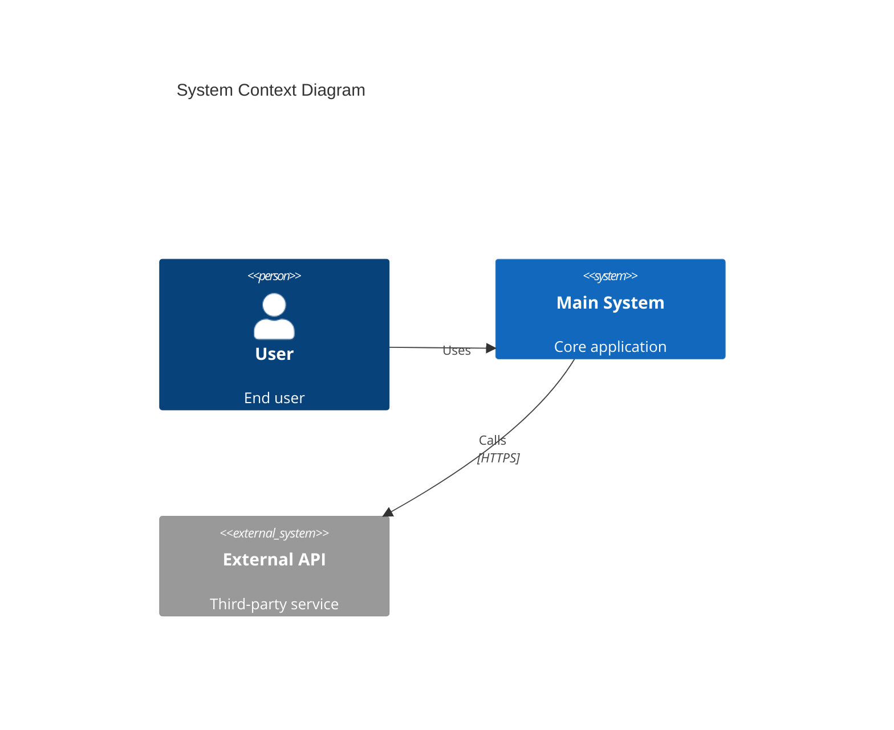

### Container Diagram (C2)

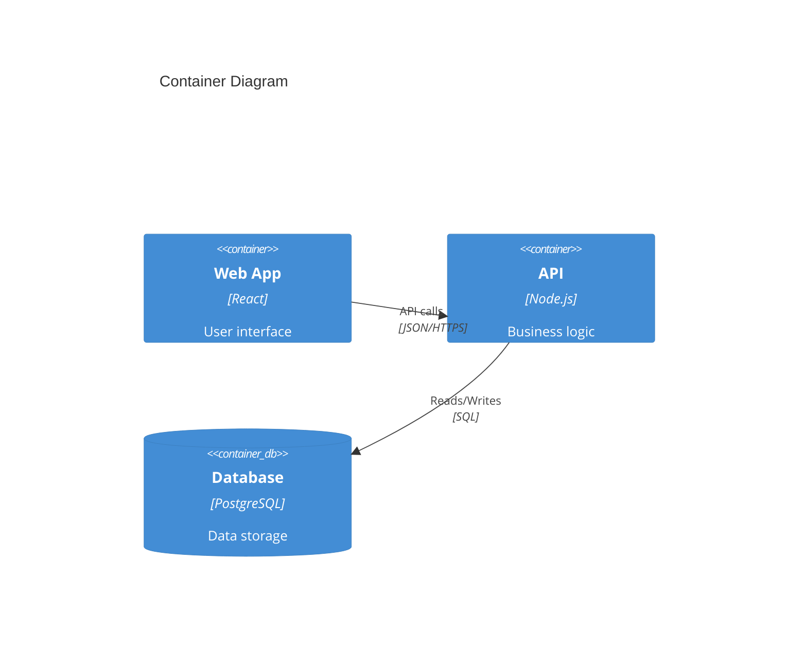

### Component Diagram (C3)

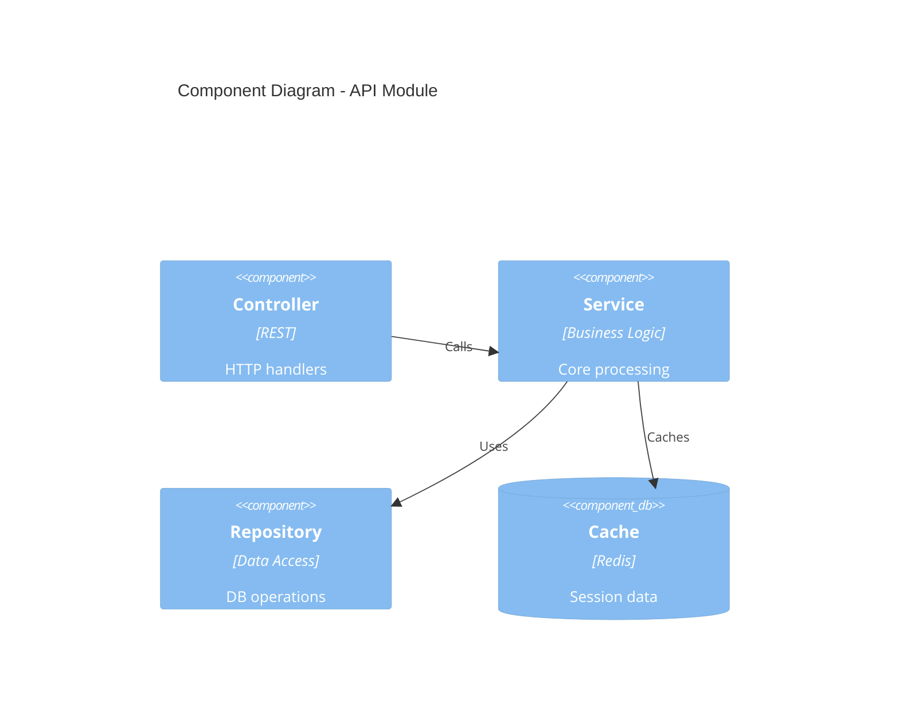

---

## Sequence Diagrams (Workflows)

### Basic Request Flow

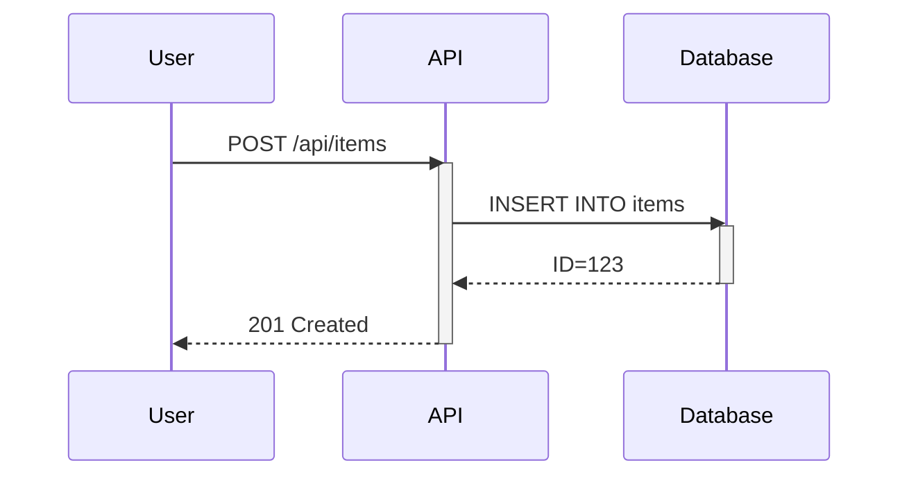

### With Alternative Paths

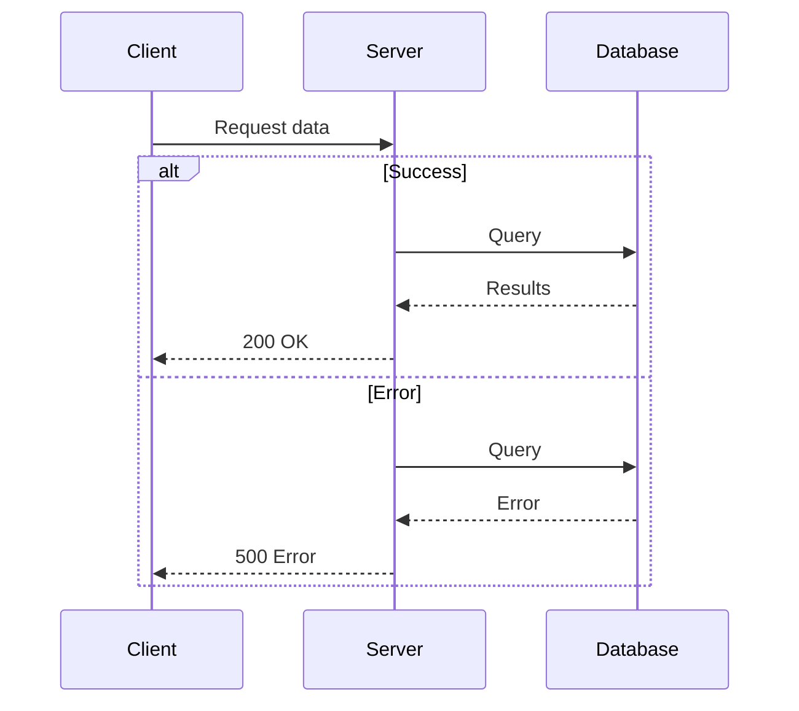

### Authentication Flow

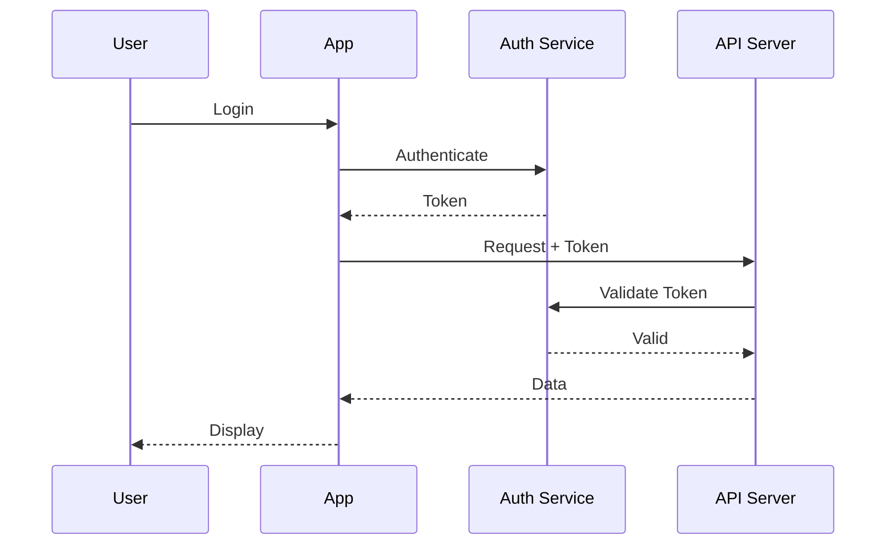

---

## Flowcharts (Decision Logic)

### Process Flow

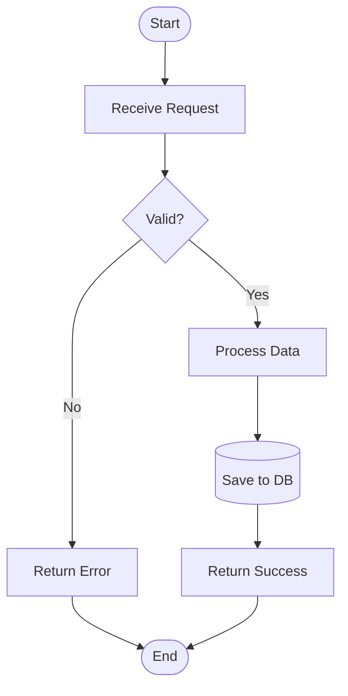

### Conditional Workflow

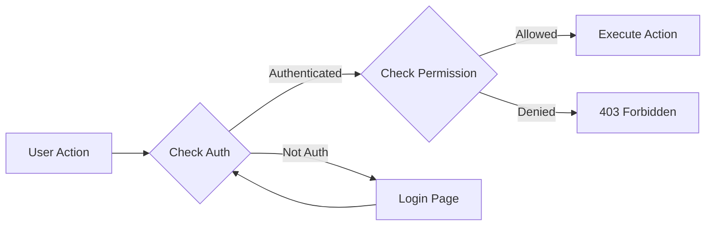

---

## Class Diagrams (Code Level)

### Basic Class Structure

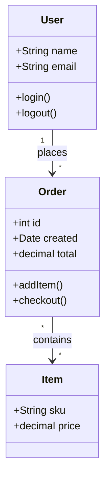

### Inheritance

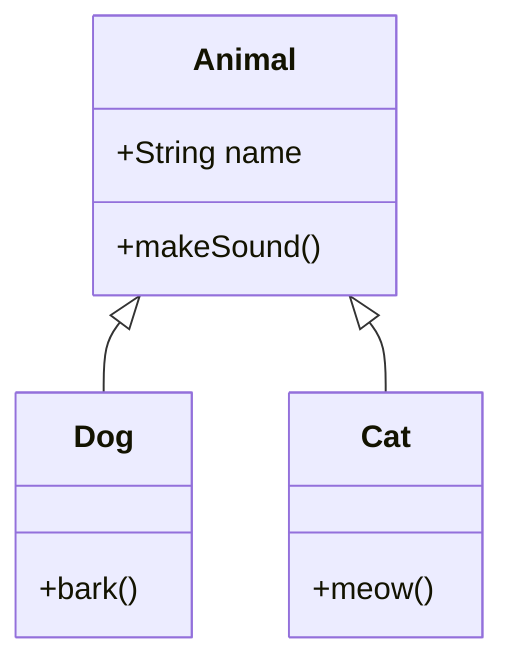

---

## State Diagrams

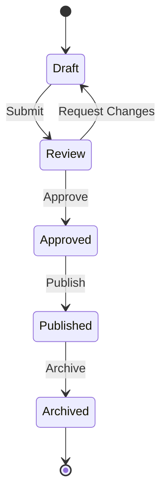

---

## Entity Relationship Diagrams

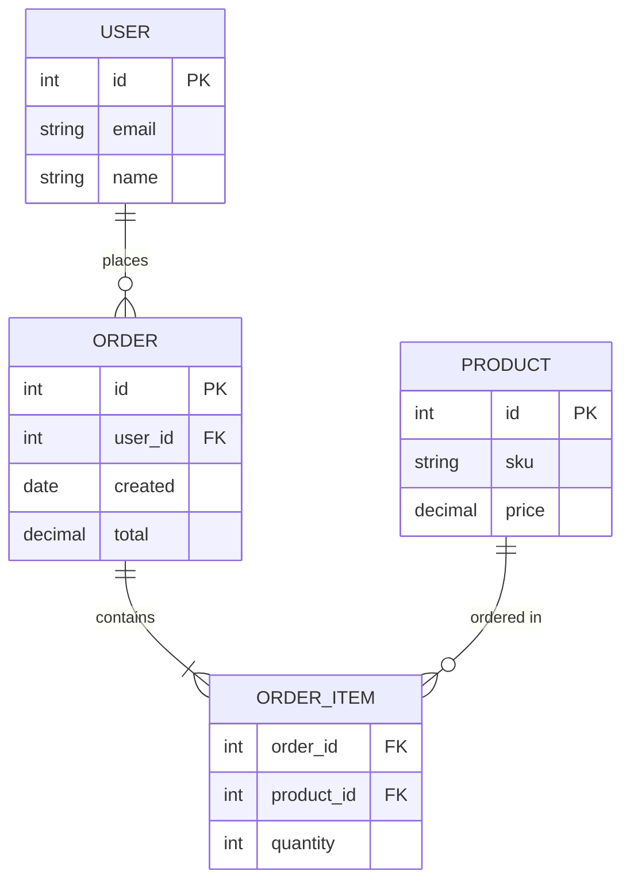

---

## Graph Diagrams (Dependencies)

### Simple Dependency Graph

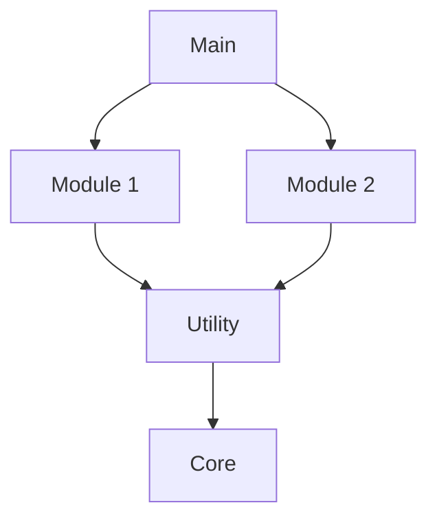

### Left-to-Right

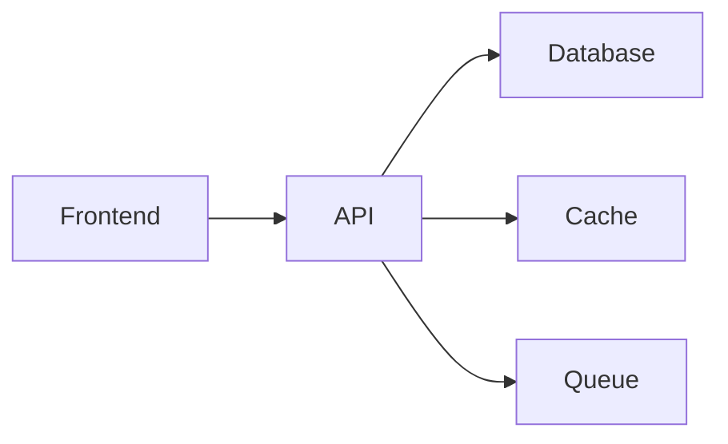

### With Styling

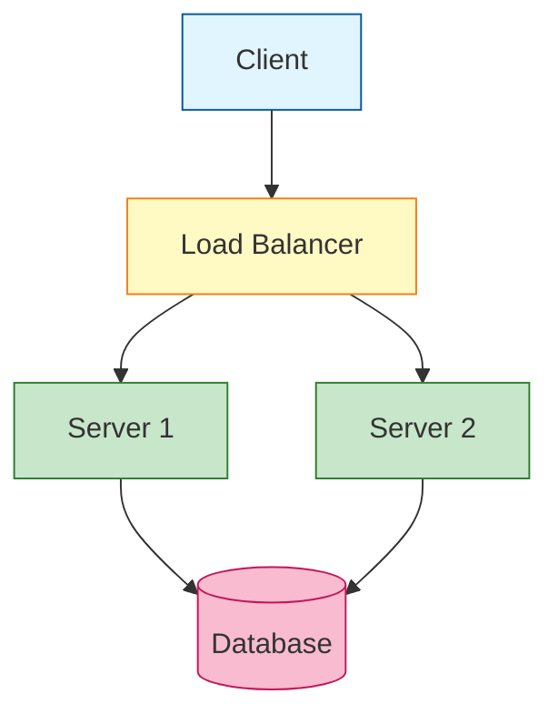

---

## Common Patterns

### Microservices Architecture

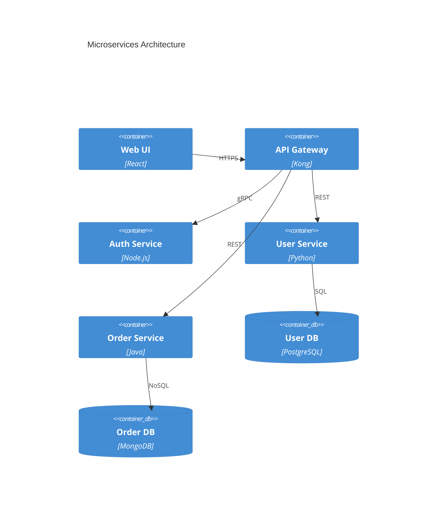

### Layered Architecture

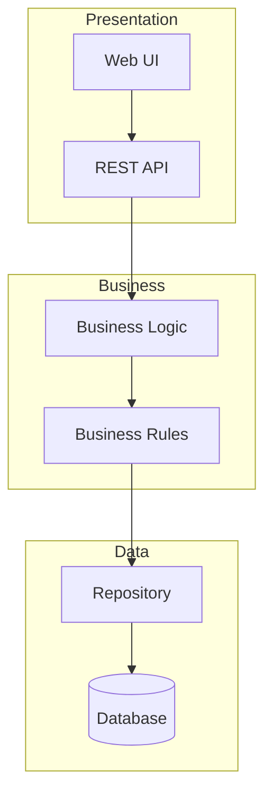

### Event-Driven Architecture

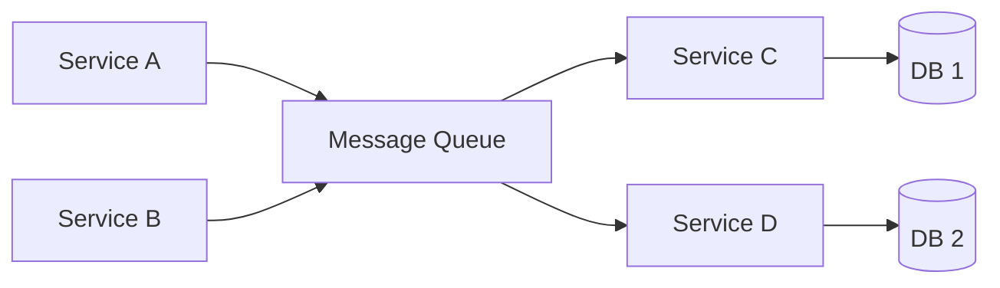

---

## Auto-Fix Patterns

### Common Mermaid Errors

❌ **Missing quotes around labels with spaces**
```mermaid
Rel(a, b, Uses API)  # Error!
```

✅ **Fixed**
```mermaid
Rel(a, b, "Uses API")  # Correct
```

❌ **Special characters not escaped**
```mermaid
System(api, "User's API")  # Error!
```

✅ **Fixed**
```mermaid
System(api, "User&apos;s API")  # Correct
```

❌ **Missing diagram type**
```mermaid
graph
    A --> B  # Error!
```

✅ **Fixed**
```mermaid
graph TD
    A --> B  # Correct
```

---

## Best Practices

1. **Keep it simple**: Max 7-10 nodes per diagram
2. **Use meaningful IDs**: `userService` not `s1`
3. **Add titles**: Every diagram should have a title
4. **Show direction**: Use arrows to indicate data flow
5. **Group related items**: Use subgraphs for modules
6. **Consistent naming**: Same entity = same name across diagrams
7. **Include technology**: Specify languages, frameworks, databases

## Diagram Selection Guide

| Need to Show | Use This Diagram |
|-------------|------------------|
| System boundaries | C4 Context |
| High-level architecture | C4 Container |
| Module internals | C4 Component |
| Data flow over time | Sequence Diagram |
| Decision logic | Flowchart |
| Code structure | Class Diagram |
| State transitions | State Diagram |
| Data relationships | ER Diagram |
| Dependencies | Graph |
