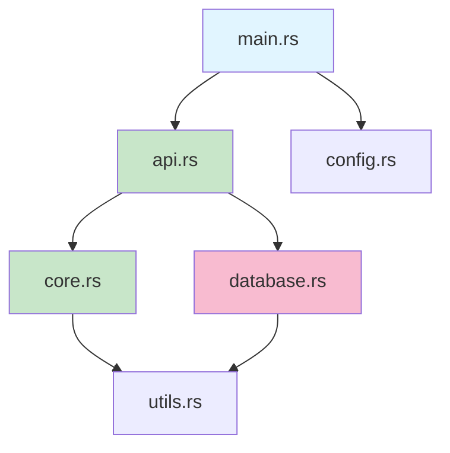
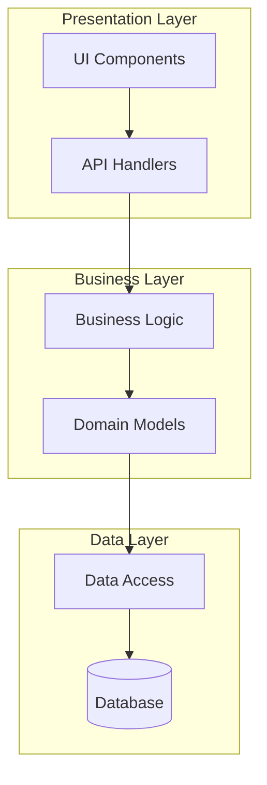
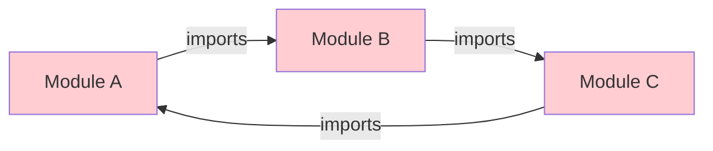
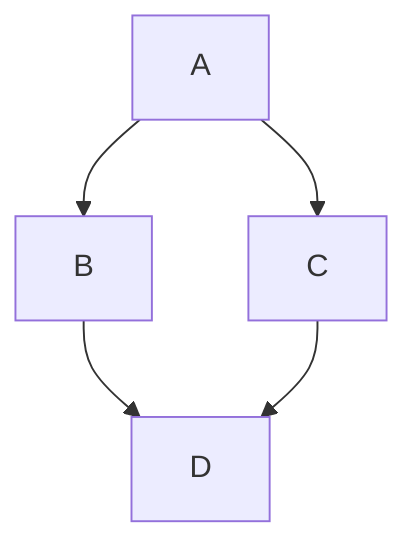
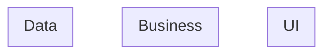
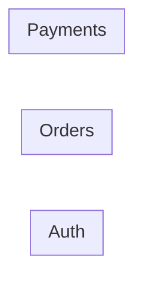
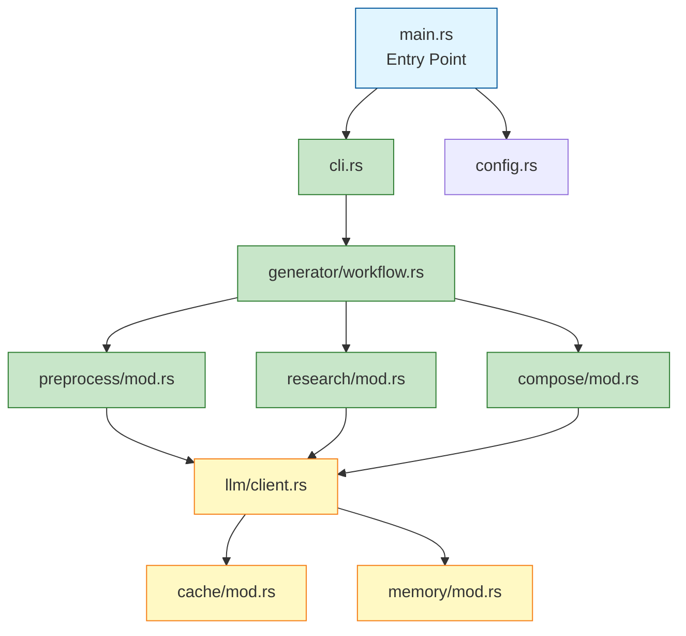

# Code Relationship Mapper Skill

## Purpose
Analyze and visualize how code modules, functions, and components relate to each other. Identify architectural patterns, detect issues like circular dependencies, and create visual maps of code structure.

## When to Use

Activate when user asks to:
- "Show me the dependency graph"
- "Visualize module relationships"
- "Find circular dependencies"
- "Map the code structure"
- "How do these modules connect?"
- "Identify tightly coupled code"

## What This Skill Provides

1. **Dependency Graphs**: Visual maps of import/require relationships
2. **Layer Detection**: Identify architectural layers (UI → Business → Data)
3. **Circular Dependency Detection**: Find problematic import cycles
4. **Coupling Analysis**: Measure how tightly modules are coupled
5. **Data Flow Visualization**: Show how data moves through the system
6. **Module Grouping**: Organize code by feature or concern

## Workflow

### Phase 1: Extract Relationships

Use `codebase-analyzer` skill output if available, or extract directly:

```bash
# Extract imports from all source files
python scripts/build_dependency_graph.py /path/to/project
```

Output:
```json
{
  "nodes": [
    {"id": "main.rs", "type": "entry", "module": "main"},
    {"id": "api.rs", "type": "module", "module": "api"},
    {"id": "core.rs", "type": "module", "module": "core"}
  ],
  "edges": [
    {"from": "main.rs", "to": "api.rs", "type": "use"},
    {"from": "api.rs", "to": "core.rs", "type": "use"}
  ]
}
```

### Phase 2: Analyze Dependencies

1. **Build Graph**: Create directed graph from imports
2. **Detect Cycles**: Find circular dependencies
3. **Calculate Metrics**:
   - **Fan-in**: How many modules depend on this one
   - **Fan-out**: How many modules this one depends on
   - **Depth**: Distance from entry point
   - **Centrality**: How central/important a module is

4. **Identify Patterns**:
   - Layered architecture
   - Hub-and-spoke
   - Microservices
   - Monolithic

### Phase 3: Visualize

Create multiple views:

#### 3a. Full Dependency Graph



#### 3b. Layer Diagram



#### 3c. Circular Dependency Detection



**Warning**: Circular dependency detected! (A → B → C → A)

### Phase 4: Generate Report

```markdown
# Code Relationship Analysis

## Overview
- **Total Modules**: 45
- **Dependencies**: 123 edges
- **Max Depth**: 5 layers
- **Circular Dependencies**: 2 found ⚠️

## Module Statistics

| Module | Fan-In | Fan-Out | Centrality | Issues |
|--------|---------|---------|------------|--------|
| core.rs | 12 | 3 | High | None |
| utils.rs | 18 | 0 | High | ⚠️ God Object? |
| api.rs | 5 | 8 | Medium | None |
| orphan.rs | 0 | 0 | None | ⚠️ Unused |

## Architecture Pattern
**Detected**: Layered Architecture (3 layers)

## Issues Found

### Circular Dependencies
1. **api.rs ↔ models.rs**
   - api.rs imports models.rs
   - models.rs imports api.rs
   - **Fix**: Extract shared types to separate module

2. **service_a.rs ↔ service_b.rs**
   - Mutual dependency between services
   - **Fix**: Consider event-driven communication

### High Coupling
- **utils.rs**: Used by 18 modules (potential god object)
  - **Recommendation**: Split into specialized utilities

### Orphaned Modules
- **orphan.rs**: Not imported by any module
  - **Action**: Remove or integrate

## Recommendations
1. Break circular dependency between api.rs and models.rs
2. Refactor utils.rs into smaller, focused modules
3. Remove or document orphan.rs
4. Consider introducing dependency injection for service layer
```

## Analysis Modes

### Quick Mode (Default)
- Extract imports from key files only
- Show high-level structure
- Identify major issues
- ~30 seconds

### Standard Mode
- Analyze all source files
- Build complete graph
- Calculate all metrics
- ~2-3 minutes

### Deep Mode
- Include test files
- Analyze function-level dependencies
- Track data flow
- Generate detailed report
- ~5-10 minutes

## Supported Languages

| Language | Import Detection | Export Detection | Quality |
|----------|------------------|------------------|---------|
| Rust | ✅ `use` statements | ✅ `pub` items | Excellent |
| Python | ✅ `import` / `from` | ✅ Functions/classes | Excellent |
| JavaScript | ✅ ES6/CommonJS | ✅ `export` | Excellent |
| TypeScript | ✅ ES6/CommonJS | ✅ `export` | Excellent |
| Java | ✅ `import` | ✅ `public` classes | Good |
| Go | ✅ `import` | ✅ Capital letters | Good |

## Visualization Types

### 1. Dependency Graph (Default)
Shows all import relationships


### 2. Layer View
Groups modules by architectural layer


### 3. Feature View
Groups by feature/domain


### 4. Heatmap View
Shows coupling intensity (requires script)
```
[High Coupling]  ███████░░░  Module A
[Medium]         ████░░░░░░  Module B
[Low Coupling]   ██░░░░░░░░  Module C
```

## Helper Scripts

### `build_dependency_graph.py`

Scans project and builds dependency graph:

```bash
python scripts/build_dependency_graph.py /path/to/project --output graph.json
```

Options:
- `--include-tests`: Include test files
- `--depth N`: Limit traversal depth
- `--format`: json|dot|mermaid

### `detect_cycles.py`

Finds circular dependencies:

```bash
python scripts/detect_cycles.py graph.json
```

Output:
```
Circular dependencies found:

Cycle 1: api.rs → models.rs → api.rs
Cycle 2: service_a.rs → service_b.rs → service_c.rs → service_a.rs
```

### `calculate_metrics.py`

Computes coupling metrics:

```bash
python scripts/calculate_metrics.py graph.json
```

Output:
```json
{
  "modules": {
    "core.rs": {
      "fan_in": 12,
      "fan_out": 3,
      "centrality": 0.85,
      "coupling": "high"
    }
  }
}
```

## Integration with Other Skills

### With codebase-analyzer
```
1. Run codebase-analyzer to extract imports
2. Feed results to code-relationship-mapper
3. Generate visualizations
```

### With architecture-documenter
```
1. Generate dependency graphs
2. Use graphs to inform C4 Container/Component diagrams
3. Document architecture patterns discovered
```

## Configuration

Create `.relationship-mapper.json` in project root:

```json
{
  "exclude_patterns": [
    "test_*.py",
    "*_test.go",
    "node_modules/*"
  ],
  "group_by": "feature",
  "layers": {
    "ui": ["src/ui/*", "src/components/*"],
    "business": ["src/services/*", "src/core/*"],
    "data": ["src/db/*", "src/models/*"]
  },
  "thresholds": {
    "max_fan_out": 10,
    "max_fan_in": 15,
    "max_depth": 6
  }
}
```

## Examples

### Example 1: Rust Project

**Command**:
```
User: "Show me the dependency graph for this Rust project"
```

**Result**:


**Analysis**:
- Clean layered structure
- No circular dependencies
- llm module is a hub (high fan-in)

### Example 2: Circular Dependency Detection

**Command**:
```
User: "Find circular dependencies in this codebase"
```

**Result**:
```
⚠️ 2 circular dependencies found:

1. api/routes.ts ↔ api/middleware.ts
   - routes.ts imports authMiddleware from middleware.ts
   - middleware.ts imports validateRoute from routes.ts

   Fix: Create shared types module

2. services/user.ts → services/order.ts → services/user.ts
   - user.ts imports createOrder from order.ts
   - order.ts imports getUserProfile from user.ts

   Fix: Use dependency injection or events
```

## Metrics Explained

### Fan-In
**Definition**: Number of modules that depend on this module
**High value means**: This module is heavily used (good if it's a utility, bad if it's specific business logic)

### Fan-Out
**Definition**: Number of modules this module depends on
**High value means**: Module has many dependencies (potential coupling issue)

### Centrality
**Definition**: How "central" a module is in the dependency graph
**High value means**: Critical module, changes affect many parts

### Depth
**Definition**: Distance from entry point (main/index)
**High value means**: Deep in the architecture, should be stable

## Best Practices

1. **Keep fan-out low**: Modules should depend on few other modules
2. **Avoid circular dependencies**: They make code hard to test and refactor
3. **Identify god objects**: Modules with very high fan-in might be doing too much
4. **Layer consistently**: Keep dependencies flowing one direction
5. **Orphans are bad**: Unused code should be removed

## Troubleshooting

### Issue: Graph too complex to read
**Solution**:
- Filter to show only key modules
- Group by feature or layer
- Use hierarchical layout

### Issue: Missing dependencies
**Solution**:
- Check that import extraction covers all patterns
- Include dynamic imports if needed
- Verify file paths are correct

### Issue: False circular dependencies
**Solution**:
- Check for type-only imports (TypeScript)
- Consider lazy loading
- Verify import resolver logic

## Output Formats

- **Mermaid**: For documentation (default)
- **DOT**: For Graphviz rendering
- **JSON**: For programmatic analysis
- **HTML**: Interactive graph (requires external tool)

## References

- `scripts/build_dependency_graph.py` - Main analysis script
- `scripts/detect_cycles.py` - Cycle detection
- `scripts/calculate_metrics.py` - Metrics computation
- `templates/graph-styles.md` - Styling options
