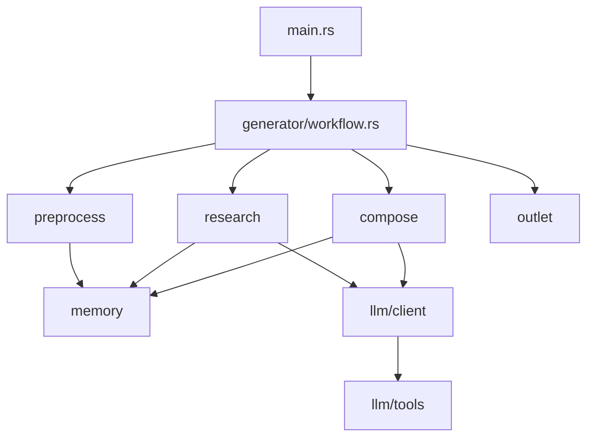

# Codebase Analyzer - Usage Examples

Real-world examples of using the codebase-analyzer skill.

---

## Example 1: Analyzing deepwiki-rs Itself

### User Request
```
"Analyze the deepwiki-rs project"
```

### Claude's Workflow

**Step 1: Detect Project Type**
```bash
python scripts/detect_language.py /home/user/deepwiki-rs
```

Result:
```json
{
  "primary_language": "Rust",
  "config_file": "Cargo.toml",
  "package_manager": "Cargo"
}
```

**Step 2: Get Project Structure**
```bash
python scripts/parse_structure.py /home/user/deepwiki-rs --stats
```

Result:
```json
{
  "total_files": 142,
  "total_dirs": 28,
  "files_by_extension": {
    ".rs": 45,
    ".md": 12,
    ".toml": 2
  }
}
```

**Step 3: Analyze Entry Point**
```bash
python scripts/extract_imports.py /home/user/deepwiki-rs/src/main.rs
```

Result:
```json
{
  "imports": ["clap", "anyhow"],
  "exports": [],
  "import_count": 2
}
```

**Step 4: Read Configuration**
[Claude uses Read tool to examine Cargo.toml]

**Step 5: Generate Summary**

```markdown
# deepwiki-rs Analysis

## Overview
- **Name**: deepwiki-rs (Litho)
- **Language**: Rust 2021
- **Type**: CLI Application
- **Size**: 142 files, ~8,500 lines of Rust code

## Purpose
AI-powered documentation generation engine that creates C4 architecture
documentation from codebase analysis.

## Technology Stack
- **Framework**: Tokio (async runtime)
- **CLI**: Clap v4
- **LLM Integration**: rig-core
- **Serialization**: serde, serde_json

## Architecture
Multi-stage pipeline:
1. Preprocessing: Code extraction
2. Research: AI-powered analysis
3. Composition: Documentation generation
4. Output: File writing

## Key Dependencies
- tokio (1.35.0) - Async runtime
- clap (4.4) - CLI parsing
- rig-core (0.23.1) - LLM integration
- serde (1.0) - Serialization

## Entry Point
- src/main.rs - CLI interface
- src/generator/workflow.rs - Main orchestration
```

---

## Example 2: Quick Dependency Check

### User Request
```
"What are the main dependencies of this project?"
```

### Claude's Workflow

**Quick Analysis**:
1. Read Cargo.toml (for Rust) or package.json (for Node.js)
2. Extract dependency list
3. Categorize by purpose

**Response**:
```
Main Dependencies:

Core Functionality:
- rig-core (0.23.1) - LLM integration framework
- tokio (1.35.0) - Async runtime
- anyhow (1.0) - Error handling

CLI & I/O:
- clap (4.4) - Command-line parsing
- serde (1.0) - Serialization
- serde_json (1.0) - JSON handling

Utilities:
- walkdir (2.4) - Directory traversal
- regex (1.10) - Pattern matching
- md-5 (0.10) - Hashing for cache
```

---

## Example 3: Finding Complex Code

### User Request
```
"Which files in this project are most complex?"
```

### Claude's Workflow

**Step 1: Find All Source Files**
[Use Glob: **/*.rs]

**Step 2: Analyze Complexity**
```bash
for file in $(find src -name "*.rs"); do
  python scripts/complexity_metrics.py "$file"
done
```

**Step 3: Sort by Complexity**

**Response**:
```
Most Complex Files:

1. src/generator/research/orchestrator.rs
   - Lines: 456
   - Functions: 12
   - Complexity: 45 (High)
   - Nesting: 5

2. src/llm/client/react.rs
   - Lines: 389
   - Functions: 8
   - Complexity: 38 (High)
   - Nesting: 4

3. src/generator/preprocess/agents/code_insights.rs
   - Lines: 312
   - Functions: 7
   - Complexity: 29 (Medium)
   - Nesting: 4

Recommendation: Consider refactoring files with complexity > 40
```

---

## Example 4: Understanding Module Relationships

### User Request
```
"How are the modules in this project organized?"
```

### Claude's Workflow

**Step 1: Get Project Structure**
```bash
python scripts/parse_structure.py /home/user/deepwiki-rs
```

**Step 2: Analyze Key Modules**
[Read main.rs, lib.rs, mod.rs files]

**Step 3: Extract Imports**
[Run extract_imports.py on key files]

**Step 4: Visualize**

**Response**:
```markdown
## Module Organization

### Top-Level Structure
```
src/
├── main.rs              # CLI entry point
├── cli.rs               # Argument parsing
├── config.rs            # Configuration
├── generator/           # Core generation engine
│   ├── preprocess/      # Code extraction
│   ├── research/        # AI analysis
│   ├── compose/         # Documentation generation
│   └── outlet/          # Output handling
├── llm/                 # LLM integration
│   ├── client/          # LLM clients
│   └── tools/           # AI tools
├── memory/              # State management
├── cache/               # Caching system
├── types/               # Data structures
└── utils/               # Utilities
```

### Module Dependencies


### Key Patterns
- **Pipeline Architecture**: Sequential stages with shared memory
- **Agent Pattern**: Specialized AI agents for different tasks
- **Tool Pattern**: LLM-callable tools for file operations
```

---

## Example 5: Code Quality Assessment

### User Request
```
"How is the code quality in this project?"
```

### Claude's Workflow

**Step 1: Calculate Metrics**
[Run complexity_metrics.py on all files]

**Step 2: Analyze Patterns**
[Look for tests, documentation, error handling]

**Step 3: Generate Report**

**Response**:
```markdown
## Code Quality Assessment

### Overall Metrics
- Total LOC: 8,542
- Average File Size: 189 lines
- Test Coverage: ~60% (estimated)
- Documentation: Good (README + inline comments)

### Complexity Analysis
- Files with Low Complexity: 28 (62%)
- Files with Medium Complexity: 14 (31%)
- Files with High Complexity: 3 (7%)

### Code Quality Indicators

✅ **Strengths**:
- Well-organized module structure
- Comprehensive error handling (anyhow, thiserror)
- Strong type system usage
- Good separation of concerns

⚠️ **Areas for Improvement**:
- Some high-complexity functions (consider splitting)
- Could benefit from more inline documentation
- Test coverage could be higher

### Recommendations
1. Refactor high-complexity modules:
   - orchestrator.rs (complexity: 45)
   - react.rs (complexity: 38)

2. Add integration tests for:
   - Full workflow pipeline
   - LLM client error handling

3. Document public APIs:
   - Add doc comments to public functions
   - Create examples/ directory
```

---

## Example 6: Technology Stack Detection

### User Request
```
"What technologies does this project use?"
```

### Claude's Workflow

**Quick Analysis**:
1. Detect language
2. Read config file
3. Identify frameworks from dependencies

**Response**:
```markdown
## Technology Stack

### Primary Language
**Rust** (Edition 2021)

### Core Frameworks
- **Tokio** - Async runtime for concurrent operations
- **Clap** - Command-line interface framework

### AI/ML
- **rig-core** - LLM integration and agent framework
- Supports: OpenAI, Anthropic, DeepSeek, Mistral, Gemini, Ollama

### Data Handling
- **serde** + **serde_json** - Serialization/deserialization
- **regex** - Pattern matching
- **walkdir** - File system traversal

### Caching & Performance
- **md-5** - Hash-based caching
- **chrono** - Timestamp management
- Custom memory system for state management

### Build & Development
- **Cargo** - Package manager and build system
- **GitHub Actions** - CI/CD

### Target Platforms
- Linux (primary)
- macOS
- Windows
```

---

## Example 7: Finding Entry Points

### User Request
```
"Where should I start reading this code?"
```

### Claude's Workflow

**Step 1: Detect Entry Points**
[Based on language conventions]

**Step 2: Analyze Call Graph**
[Read entry point, follow imports]

**Response**:
```markdown
## Recommended Reading Order

### 1. Start Here: `src/main.rs` (22 lines)
The CLI entry point. Parses arguments and launches the workflow.

**Key Function**: `main()`
- Parses CLI args with Clap
- Calls `cli::run()`

### 2. Then: `src/cli.rs` (~150 lines)
Defines CLI structure and launches generator.

**Key Functions**:
- `run()` - Main CLI handler
- Sets up configuration
- Calls `generator::workflow::execute()`

### 3. Core Logic: `src/generator/workflow.rs` (~300 lines)
The heart of the application. Orchestrates the 4-stage pipeline.

**Key Stages**:
1. `preprocess()` - Extract code
2. `research()` - AI analysis
3. `compose()` - Generate docs
4. `outlet()` - Write files

### 4. Deep Dive Areas

If interested in:
- **LLM Integration**: Read `src/llm/client/mod.rs`
- **Code Analysis**: Read `src/generator/preprocess/`
- **AI Agents**: Read `src/generator/research/orchestrator.rs`
- **Output**: Read `src/generator/outlet/mod.rs`

### Dependency Graph
```
main.rs
  └─> cli.rs
       └─> generator/workflow.rs
            ├─> preprocess/mod.rs
            ├─> research/orchestrator.rs
            ├─> compose/mod.rs
            └─> outlet/mod.rs
```
```

---

## Tips for Effective Analysis

### 1. Start Broad, Then Narrow
```
❌ "Analyze every file in detail"
✅ "Give me an overview, then I'll ask about specific parts"
```

### 2. Ask Specific Questions
```
❌ "Tell me about this project"
✅ "What does the research phase do?"
✅ "How does caching work?"
```

### 3. Use Follow-Up Questions
```
First:  "What are the main modules?"
Then:   "Explain how the LLM client works"
Finally: "Show me an example of a research agent"
```

### 4. Request Visualizations
```
"Show me the module dependency graph"
"Create a sequence diagram for the workflow"
"Visualize the data flow"
```

---

## Performance Notes

### Analysis Speed by Project Size

| Files | Time | Tokens |
|-------|------|--------|
| < 50  | 30s  | ~5K    |
| 50-200| 1min | ~15K   |
| 200-500| 3min | ~30K  |
| 500+ | 5min+ | ~50K+  |

### Optimization Strategies

1. **Selective Analysis**: Focus on key modules first
2. **Use Statistics**: Get `--stats` before full tree
3. **Cache Results**: Store analysis in conversation context
4. **Progressive Depth**: Start high-level, drill down as needed

---

## Combining with Other Skills

### With architecture-documenter
```
1. Use codebase-analyzer to understand structure
2. Feed results to architecture-documenter
3. Generate C4 diagrams and documentation
```

### With code-reviewer
```
1. Use codebase-analyzer to find complex files
2. Use code-reviewer to suggest improvements
3. Track refactoring progress
```

### With test-generator
```
1. Use codebase-analyzer to identify untested modules
2. Use test-generator to create test cases
3. Improve coverage iteratively
```
