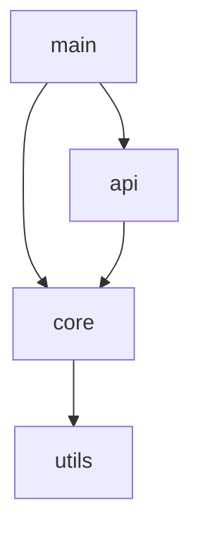

# Codebase Analyzer Skill

## Purpose
Systematically analyze source code repositories to understand:
- Project structure and organization
- Dependencies (internal and external)
- Code relationships and data flow
- Architecture patterns
- Key components and interfaces

**This skill uses only Claude's built-in capabilities plus lightweight Python scripts.**

## When to Use

Activate this skill when the user asks to:
- "Analyze this codebase"
- "Understand the project structure"
- "What does this project do?"
- "Extract dependencies"
- "Map the architecture"
- "Explain how this code works"

## How It Works

### Phase 1: Project Discovery

1. **Detect Project Type**
   ```bash
   python scripts/detect_language.py .
   ```
   Identifies language, framework, and build tools by checking for:
   - `Cargo.toml` → Rust
   - `package.json` → JavaScript/TypeScript/Node.js
   - `pyproject.toml` / `setup.py` → Python
   - `pom.xml` / `build.gradle` → Java/Kotlin
   - `go.mod` → Go

2. **Read Configuration**
   Extract project metadata from config files:
   - Project name and version
   - Dependencies
   - Build scripts
   - Entry points

3. **Scan Directory Structure**
   Use Glob to find source files, tests, docs:
   ```
   **/*.rs, **/*.py, **/*.js, **/*.ts, etc.
   ```

### Phase 2: Code Analysis

For each major module/directory:

1. **Extract Imports/Dependencies**
   ```bash
   python scripts/extract_imports.py <file_path>
   ```
   Parses import statements to build dependency graph

2. **Identify Components**
   - Entry points (main.rs, index.js, __main__.py)
   - Core modules (src/core/, lib/)
   - Utilities (utils/, helpers/)
   - Tests (tests/, __tests__/)

3. **Read Key Files**
   Use Claude's Read tool to understand:
   - Main module logic
   - Public APIs
   - Data structures
   - Algorithms

4. **Calculate Metrics** (optional)
   ```bash
   python scripts/complexity_metrics.py <file_path>
   ```
   Estimates code complexity, file sizes, nesting depth

### Phase 3: Relationship Mapping

1. **Build Dependency Graph**
   - Module A imports Module B
   - Package X depends on Package Y

2. **Identify Patterns**
   - Layered architecture (UI → Business → Data)
   - Microservices
   - Plugin architecture
   - Event-driven patterns

3. **Extract Interfaces**
   - Public functions and classes
   - API endpoints
   - Configuration options

### Phase 4: Synthesis

Generate comprehensive analysis report with:
- Executive summary
- Technology stack
- Architecture overview
- Module inventory
- Dependency visualization
- Key findings and recommendations

## Output Format

The skill produces a structured markdown report:

```markdown
# Codebase Analysis: [Project Name]

## 📊 Project Overview
- **Name**: [name]
- **Primary Language**: [language]
- **Framework**: [framework]
- **Size**: [X] files, ~[Y] lines of code
- **Last Updated**: [date]

## 🏗️ Architecture

### Project Structure
```
src/
├── core/           # Core business logic
├── api/            # API endpoints
├── utils/          # Utilities
└── tests/          # Test suite
```

### Technology Stack
- **Language**: Rust 2021
- **Framework**: Actix-web 4.x
- **Database**: PostgreSQL via SQLx
- **Build Tool**: Cargo

## 📦 Dependencies

### External Dependencies
1. **actix-web** (4.4.0) - Web framework
2. **tokio** (1.35.0) - Async runtime
3. **serde** (1.0) - Serialization

### Internal Module Dependencies


## 🔑 Key Components

### 1. Core Module (`src/core/mod.rs`)
- **Purpose**: Business logic and domain models
- **Exports**: `User`, `Transaction`, `validate()`
- **Dependencies**: `utils::validator`, `serde`
- **Complexity**: Medium (500 lines)

### 2. API Module (`src/api/mod.rs`)
- **Purpose**: HTTP endpoints and routing
- **Exports**: `configure_routes()`, `handlers`
- **Dependencies**: `actix-web`, `core`
- **Complexity**: Low (200 lines)

## 💡 Key Findings

### Strengths
- ✅ Well-organized module structure
- ✅ Comprehensive test coverage
- ✅ Clear separation of concerns

### Areas for Improvement
- ⚠️ Some circular dependencies detected
- ⚠️ Large utility module (consider splitting)
- 💡 Consider adding API documentation

## 🔗 Integration Points

### Entry Point
- `src/main.rs` - Application entry, initializes web server

### Public API
- REST endpoints at `/api/v1/*`
- WebSocket at `/ws`

### Configuration
- Loads from `config.toml` and environment variables
```

## Helper Scripts

### Available Scripts

1. **`scripts/detect_language.py <project_path>`**
   - Detects project type and configuration
   - Output: JSON with language, framework, source directories

2. **`scripts/extract_imports.py <file_path>`**
   - Extracts import/use/require statements
   - Output: JSON with dependency list

3. **`scripts/complexity_metrics.py <file_path>`**
   - Calculates code metrics (lines, nesting, complexity)
   - Output: JSON with metrics

4. **`scripts/parse_structure.py <project_path>`**
   - Generates project structure tree
   - Output: Formatted directory tree

See `reference/script-usage.md` for detailed usage and examples.

## Best Practices

1. **Start Broad, Then Narrow**
   - First: High-level structure scan (directories, config files)
   - Then: Focus on key modules based on user interest

2. **Progressive Analysis**
   - Don't analyze every file immediately
   - Sample representative files first
   - Drill down on user request

3. **Use Caching**
   - Store analysis in conversation context
   - Reuse for follow-up questions
   - Avoid re-analyzing unchanged code

4. **Handle Errors Gracefully**
   - Skip binary files
   - Handle encoding issues
   - Report issues but continue

## Performance Tips

For large codebases (>500 files):
- Analyze only key directories initially
- Use Grep with file type filters
- Limit initial detailed analysis to ~20-30 files
- Expand on-demand based on user queries

## Language-Specific Patterns

### Rust
- Look for: `pub struct`, `pub fn`, `pub trait`
- Entry: `main.rs` or `lib.rs`
- Tests: `#[cfg(test)]`, `tests/` directory

### Python
- Look for: `class`, `def`, `from ... import`
- Entry: `__main__.py`, `main.py`, `app.py`
- Tests: `test_*.py`, `*_test.py`

### JavaScript/TypeScript
- Look for: `export`, `import`, `class`, `function`
- Entry: `index.js`, `main.js`, `src/index.ts`
- Tests: `*.test.js`, `*.spec.ts`

See `reference/language-patterns.md` for comprehensive patterns.

## Integration with Other Skills

This skill's output can be consumed by:
- **architecture-documenter** - Generate C4 documentation
- **dependency-visualizer** - Create interactive graphs
- **code-reviewer** - Identify code quality issues
- **test-generator** - Suggest test cases

## Troubleshooting

### Issue: Python scripts not found
**Solution**: Ensure you're running from the project root, or use:
```bash
cd .claude/skills/codebase-analyzer
python scripts/detect_language.py /full/path/to/project
```

### Issue: Permission denied
**Solution**: Make scripts executable:
```bash
chmod +x scripts/*.py
```

### Issue: Unsupported language
**Solution**: Check `reference/language-patterns.md` for supported languages.
The skill can still analyze structure even for unknown languages.

## Examples

### Example 1: Rust Web API
```
User: "Analyze this Rust project"

Claude (using this skill):
1. Detects Rust via Cargo.toml
2. Reads Cargo.toml for dependencies
3. Scans src/ directory
4. Extracts use statements from key files
5. Identifies actix-web framework
6. Analyzes route handlers
7. Generates architecture overview
```

### Example 2: Python Data Science Project
```
User: "What does this Python project do?"

Claude:
1. Detects Python via pyproject.toml
2. Identifies Jupyter notebooks
3. Reads requirements.txt
4. Recognizes pandas, numpy, scikit-learn
5. Analyzes notebook flow
6. Explains data pipeline
```

## Reference Documentation

For detailed information, see:
- `reference/analysis-workflow.md` - Complete workflow details
- `reference/language-patterns.md` - Language-specific regex patterns
- `reference/script-usage.md` - Helper script documentation
- `reference/examples.md` - Real-world analysis examples
