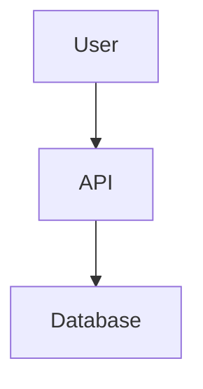
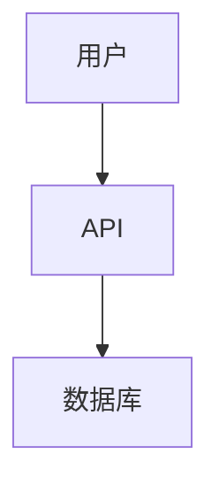
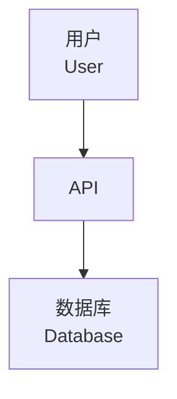

# Multi-Language Documentation Generator Skill

## Purpose
Create localized versions of technical documentation in 8 supported languages, maintaining technical accuracy and cultural appropriateness.

## When to Use

Activate when user requests:
- "Translate this documentation to Chinese"
- "Generate Japanese version of the docs"
- "Create multi-language documentation"
- "I need docs in Korean"
- "Localize this README"

## Supported Languages

| Language | Code | Native Name | Status |
|----------|------|-------------|--------|
| English | en | English | ✅ Source |
| Chinese (Simplified) | zh | 简体中文 | ✅ Full |
| Japanese | ja | 日本語 | ✅ Full |
| Korean | ko | 한국어 | ✅ Full |
| German | de | Deutsch | ✅ Full |
| French | fr | Français | ✅ Full |
| Russian | ru | Русский | ✅ Full |
| Vietnamese | vi | Tiếng Việt | ✅ Full |

## Translation Principles

### 1. Preserve Technical Terms
**DON'T** translate:
- Programming language names (Rust, Python, JavaScript)
- Framework names (React, Django, Spring Boot)
- Tool names (Docker, Kubernetes, Git)
- File names and extensions (.rs, package.json)
- Code syntax and keywords
- Command-line commands
- API endpoint names
- Variable/function names in examples

**DO** translate:
- Descriptions and explanations
- User interface text
- Error messages
- Comments (with cultural context)

### 2. Keep Code Blocks Intact
```rust
// ❌ Don't translate code or comments in code blocks
fn main() {
    println!("Hello, world!");  // English comment stays
}
```

### 3. Preserve Markdown Structure
- Keep heading levels (#, ##, ###)
- Maintain link syntax
- Preserve image references
- Keep table formatting
- Maintain list structure

### 4. Cultural Adaptation
- Use culturally appropriate examples
- Adapt idioms and metaphors
- Adjust formatting conventions (dates, numbers)
- Consider reading direction (RTL for some languages)

## Workflow

### Phase 1: Analyze Source Document

1. **Detect Document Type**
   - README file
   - API documentation
   - Tutorial/Guide
   - Architecture documentation (C4)
   - Reference documentation

2. **Extract Elements**
   - Text to translate
   - Code blocks (preserve)
   - Diagrams (may need label translation)
   - Links (preserve or localize)
   - Metadata (translate)

### Phase 2: Translation Strategy

**For each target language**:

1. **Load Language Profile** (from `locales/{lang}.json`)
   - Technical term glossary
   - Cultural conventions
   - Formatting rules

2. **Translate Sections**
   - Headings
   - Paragraphs
   - Lists
   - Table content
   - Diagram labels (if applicable)

3. **Preserve Structure**
   - Keep all Markdown syntax
   - Maintain code blocks untouched
   - Preserve links and references

### Phase 3: Quality Checks

1. **Technical Accuracy**
   - Verify technical terms are correct
   - Check that code examples work
   - Ensure commands are valid

2. **Language Quality**
   - Natural phrasing
   - Consistent terminology
   - Appropriate formality level

3. **Formatting**
   - Markdown renders correctly
   - Links work
   - Tables align
   - Lists formatted

### Phase 4: Output Organization

Create language-specific directories:

```
docs/
├── en/
│   ├── README.md
│   ├── architecture.md
│   └── api.md
├── zh/
│   ├── README.md
│   ├── architecture.md
│   └── api.md
├── ja/
│   ├── README.md
│   ├── architecture.md
│   └── api.md
└── ...
```

Or use suffixed files:
```
docs/
├── README.md
├── README.zh.md
├── README.ja.md
├── README.ko.md
└── ...
```

## Translation Templates

### README Template

English:
```markdown
# Project Name

## Overview
This is a tool for...

## Installation
```bash
npm install project-name
```

## Usage
```javascript
const project = require('project-name');
```
```

Chinese (Simplified):
```markdown
# Project Name

## 概述
这是一个用于...的工具

## 安装
```bash
npm install project-name
```

## 使用方法
```javascript
const project = require('project-name');
```
```

### API Documentation Template

English:
```markdown
## API Reference

### `initialize(config)`

**Parameters:**
- `config` (Object): Configuration options
  - `apiKey` (string): Your API key
  - `timeout` (number): Request timeout in ms

**Returns:** Promise<Client>

**Example:**
```javascript
const client = await initialize({
  apiKey: 'xxx',
  timeout: 5000
});
```
```

Japanese:
```markdown
## API リファレンス

### `initialize(config)`

**パラメータ:**
- `config` (Object): 設定オプション
  - `apiKey` (string): APIキー
  - `timeout` (number): リクエストタイムアウト(ミリ秒)

**戻り値:** Promise<Client>

**例:**
```javascript
const client = await initialize({
  apiKey: 'xxx',
  timeout: 5000
});
```
```

## Common Phrases by Language

### Headings

| English | 中文 | 日本語 | 한국어 |
|---------|------|--------|--------|
| Overview | 概述 | 概要 | 개요 |
| Installation | 安装 | インストール | 설치 |
| Usage | 使用方法 | 使い方 | 사용법 |
| API Reference | API 参考 | APIリファレンス | API 참조 |
| Examples | 示例 | 例 | 예제 |
| Configuration | 配置 | 設定 | 구성 |
| Troubleshooting | 故障排除 | トラブルシューティング | 문제 해결 |

### Common Terms

| English | 中文 | 日本語 | 한국어 |
|---------|------|--------|--------|
| Parameters | 参数 | パラメータ | 매개변수 |
| Returns | 返回值 | 戻り値 | 반환값 |
| Example | 示例 | 例 | 예제 |
| Required | 必需 | 必須 | 필수 |
| Optional | 可选 | オプション | 선택 사항 |
| Default | 默认 | デフォルト | 기본값 |

Reference: `locales/glossary.md` for complete term list.

## Mermaid Diagram Localization

### Option 1: Keep English (Recommended)

✅ Universal understanding, no translation needed

### Option 2: Translate Labels
Chinese:

⚠️ Requires diagram regeneration per language

### Option 3: Bilingual

✅ Best of both worlds, but more verbose

## Special Considerations

### Chinese (Simplified)
- Use simplified characters (简体), not traditional (繁體)
- Formal tone for technical docs
- Technical terms often kept in English
- Number formatting: 1,234.56 → 1,234.56

### Japanese
- Use polite form (です・ます調)
- Mix kanji, hiragana, katakana appropriately
- Technical terms often in katakana
- Code blocks use half-width characters
- Number formatting: 1,234.56 → 1,234.56

### Korean
- Use formal register (합쇼체)
- Technical terms often kept in English
- Proper spacing between words
- Number formatting: 1,234.56 → 1,234.56

### German
- Capitalize all nouns
- Technical terms usually in English
- Use formal "Sie" not informal "du"
- Number formatting: 1,234.56 → 1.234,56

### French
- Technical terms often English-ized
- Use formal "vous"
- Proper accents (é, è, ê, à, etc.)
- Number formatting: 1,234.56 → 1 234,56

### Russian
- Cyrillic alphabet
- Technical terms in Latin script
- Formal tone
- Number formatting: 1,234.56 → 1 234,56

### Vietnamese
- Use proper diacritics (á, à, ả, ã, ạ, etc.)
- Technical terms in English
- Formal language
- Number formatting: 1,234.56 → 1.234,56

## Automation Workflow

### Batch Translation

```bash
# Translate README to all languages
translate-doc README.md --all-languages

# Translate specific language
translate-doc README.md --lang zh

# Translate entire docs folder
translate-doc docs/ --recursive --languages zh,ja,ko
```

### Incremental Updates

When source English doc changes:
1. Detect changed sections
2. Re-translate only changes
3. Merge with existing translations
4. Preserve custom modifications

## Quality Assurance

### Checklist per Language

- [ ] All headings translated
- [ ] Code blocks untouched
- [ ] Links working
- [ ] Technical terms consistent
- [ ] Natural phrasing (native speaker review)
- [ ] Markdown renders correctly
- [ ] Examples culturally appropriate
- [ ] Numbers/dates formatted per locale
- [ ] No machine translation artifacts

### Review Process

1. **Automatic Translation** (Initial)
   - Use this skill for first pass
   - Fast, consistent terminology

2. **Technical Review**
   - Verify technical accuracy
   - Check code examples work

3. **Native Speaker Review** (Recommended)
   - Polish phrasing
   - Cultural appropriateness
   - Idiomatic expressions

## Integration with Other Skills

### With architecture-documenter
```
1. Generate C4 documentation in English
2. Use multi-language-doc-generator to create localized versions
3. Optionally translate diagram labels
```

### With codebase-analyzer
```
1. Generate analysis report in English
2. Translate executive summary to target languages
3. Keep technical details in English
```

## Configuration

Create `.i18n-config.json`:

```json
{
  "source_language": "en",
  "target_languages": ["zh", "ja", "ko"],
  "preserve_terms": ["Rust", "Docker", "API", "JSON"],
  "output_structure": "subdirectory",
  "review_required": true,
  "transliterate_names": false
}
```

## Examples

### Example 1: README Translation

**Input (English)**:
```markdown
# AwesomeLib

A high-performance library for data processing.

## Installation

```bash
npm install awesome-lib
```

## Quick Start

```javascript
const lib = require('awesome-lib');
const result = lib.process(data);
```
```

**Output (Japanese)**:
```markdown
# AwesomeLib

データ処理用の高性能ライブラリです。

## インストール

```bash
npm install awesome-lib
```

## クイックスタート

```javascript
const lib = require('awesome-lib');
const result = lib.process(data);
```
```

### Example 2: API Documentation

**Input (English)**:
```markdown
### `fetchData(url, options)`

Fetches data from a remote URL.

**Parameters:**
- `url` (string): The URL to fetch
- `options` (Object): Optional settings
  - `timeout` (number): Request timeout in ms
  - `headers` (Object): HTTP headers

**Returns:** Promise<Response>
```

**Output (Korean)**:
```markdown
### `fetchData(url, options)`

원격 URL에서 데이터를 가져옵니다.

**매개변수:**
- `url` (string): 가져올 URL
- `options` (Object): 선택적 설정
  - `timeout` (number): 요청 타임아웃(밀리초)
  - `headers` (Object): HTTP 헤더

**반환값:** Promise<Response>
```

## Best Practices

1. **Translate from English**: Always start with well-written English docs
2. **Use glossaries**: Maintain consistent terminology
3. **Get native review**: Machine translation needs human polish
4. **Update together**: Keep all language versions in sync
5. **Version clearly**: Indicate translation date/version
6. **Test examples**: Run code in all language docs
7. **Consider SEO**: Localized docs improve discoverability

## Limitations

- Initial translation is AI-assisted, may need review
- Cultural nuances require native speaker input
- Technical accuracy is prioritized over literary quality
- Some idioms may not translate well

## References

- `locales/glossary.md` - Technical term translations
- `locales/{lang}.json` - Language-specific rules
- `examples/` - Sample translations

## Contributing Translations

To improve translations:
1. Review existing translations
2. Submit corrections via glossary updates
3. Add language-specific conventions
4. Test with native speakers
